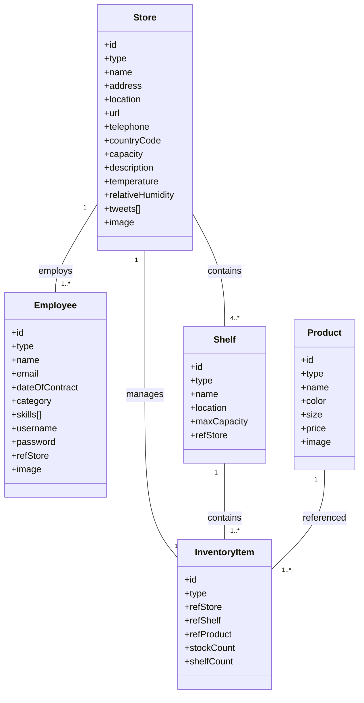

# Data Model
## NGSIv2 Entities - Aplicacion FIWARE Inventario

Version documental: 1.2  
Ultima actualizacion: 2026-04-06

## 1. Resumen

El sistema usa NGSIv2 sobre Orion con 5 entidades principales:

- Store
- Employee
- Shelf
- Product
- InventoryItem

Las relaciones se implementan con atributos Relationship (refStore, refShelf, refProduct).

## 2. Diagrama UML (modelo logico)

## 3. Entidades y atributos

### 3.1 Store

Id ejemplo:

- urn:ngsi-ld:Store:001

Atributos esperados:

- id: String (obligatorio)
- type: String = Store
- name: Text (obligatorio)
- address: PostalAddress (opcional en CRUD, frecuente en seed)
- location: geo:json Point (opcional en CRUD, usada por mapas)
- url: URL
- telephone: Text
- countryCode: Text (2 caracteres)
- capacity: Integer
- description: Text
- temperature: Float
- relativeHumidity: Float
- tweets: Array
- image: URL

### 3.2 Employee

Id ejemplo:

- urn:ngsi-ld:Employee:001

Atributos esperados:

- id: String (obligatorio)
- type: String = Employee
- name: Text (obligatorio)
- email: Text (obligatorio)
- dateOfContract: DateTime (obligatorio)
- category: Text (obligatorio)
- skills: Array (obligatorio)
- username: Text (obligatorio)
- password: Text (obligatorio)
- refStore: Relationship (obligatorio)
- image: URL

Categorias validas de negocio:

- Manager
- Warehouse
- Sales
- CustomerSupport

### 3.3 Shelf

Id ejemplo:

- urn:ngsi-ld:Shelf:unit001

Atributos esperados:

- id: String (obligatorio)
- type: String = Shelf
- name: Text (obligatorio)
- location: geo:json Point (opcional)
- maxCapacity: Integer (obligatorio)
- refStore: Relationship (obligatorio)

### 3.4 Product

Id ejemplo:

- urn:ngsi-ld:Product:001

Atributos esperados:

- id: String (obligatorio)
- type: String = Product
- name: Text (obligatorio)
- color: Text en formato #RRGGBB (obligatorio)
- size: Text en {XS, S, M, L, XL} (obligatorio)
- price: Integer (obligatorio)
- image: URL

Nota de negocio sobre price:

- La aplicacion maneja actualmente price como entero sin decimales y lo muestra en UI como EUR <valor>.

### 3.5 InventoryItem

Id ejemplo:

- urn:ngsi-ld:InventoryItem:001

Atributos esperados:

- id: String (obligatorio)
- type: String = InventoryItem
- refStore: Relationship (obligatorio)
- refShelf: Relationship (obligatorio)
- refProduct: Relationship (obligatorio)
- stockCount: Integer (obligatorio)
- shelfCount: Integer (obligatorio)

## 4. Relaciones e integridad

Reglas de integridad aplicadas por backend:

- Employee.refStore debe referenciar un Store valido.
- Shelf.refStore debe referenciar un Store valido.
- InventoryItem.refStore debe referenciar un Store valido.
- InventoryItem.refShelf debe referenciar un Shelf valido.
- InventoryItem.refProduct debe referenciar un Product valido.
- En alta de InventoryItem se evitan duplicados por combinacion de negocio:
  - Product Detail: Product + Shelf.
  - Store Detail: Store + Shelf + Product.

## 5. Proyecciones de lectura derivadas

### 5.1 Product inventory grouped

Proyeccion generada por backend para Product Detail:

- productId
- stores[] con:
  - storeId
  - storeName
  - stockCount agregado
  - shelves[] con shelfId, shelfName, shelfCount

### 5.2 Store inventory grouped

Proyeccion generada por backend para Store Detail:

- store con datos generales y coordenadas derivadas
- shelves[] con:
  - shelfId
  - shelfName
  - maxCapacity
  - fillCount
  - fillPercent
  - items[] con productId, name, image, price, size, color, stockCount, shelfCount

Incluye estanterias vacias (items = []).

## 6. Atributos externos de contexto (Store)

Se registran providers para:

- temperature
- relativeHumidity
- tweets

Endpoints de provider usados actualmente:

- http://tutorial:3000/random/weatherConditions
- http://tutorial:3000/catfacts/tweets

## 7. Datos semilla (objetivo operativo)

El script import-data mantiene como minimo:

- 4 Store
- 4 Employee
- 10 Product
- 16 Shelf
- 64 InventoryItem

Tambien registra suscripciones para:

- Cambios de Product.price
- Alertas de InventoryItem.stockCount bajo

## 8. Compatibilidad con UI

El esquema actual soporta estas capacidades de presentacion:

- Mapa de tiendas via Store.location.
- Metrica ambiental por Store (temperature, relativeHumidity).
- Tweets por Store (tweets).
- Swatch visual de Product.color.
- Banderas por Store.countryCode.
- Tabla y 3D por Shelf usando agregados de InventoryItem.
