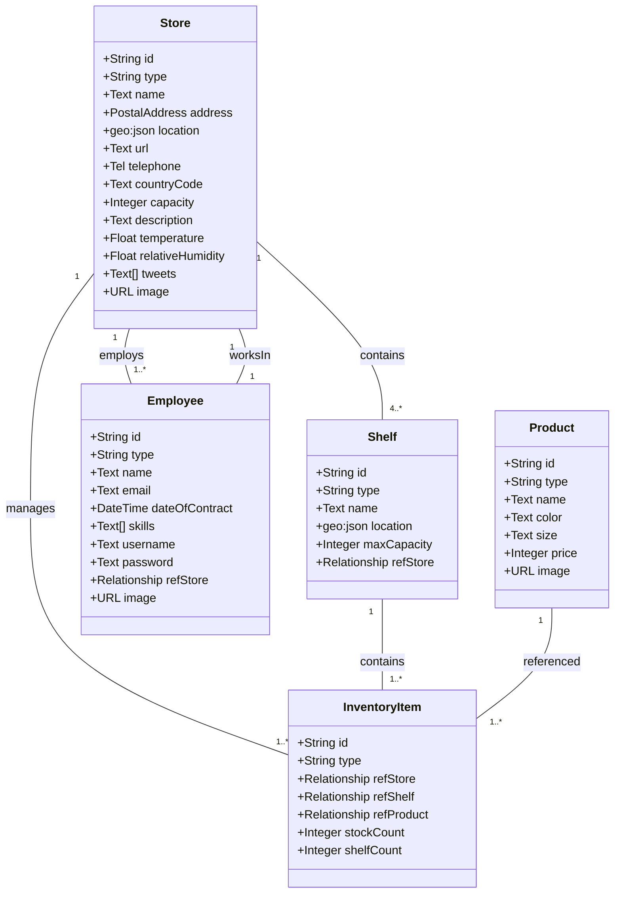

# Data Model
## NGSIv2 Entities – Aplicación FIWARE Inventario

**Formato:** NGSI-v2 (Orion Context Broker compatible)

---

## 1. Diagrama UML (Mermaid)



---

## 2. Entidades Detalladas

### 2.1 Employee

**Id:** `urn:ngsi-ld:Employee:001` (patrón NGSI-LD compatible)

**Atributos:**

| Atributo | Tipo | Obligatorio | Descripción |
|----------|------|-------------|-------------|
| id | String | ✓ | Identificador único |
| type | String | ✓ | "Employee" (constante) |
| name | Text | ✓ | Nombre completo |
| email | Text | ✓ | Email laboral |
| dateOfContract | DateTime | ✓ | Fecha contratación (ISO 8601) |
| skills | Array(Text) | ✓ | ['MachineryDriving', 'WritingReports', 'CustomerRelationships'] |
| username | Text | ✓ | Usuario login |
| password | Text | ✓ | Contraseña (hash en producc.) |
| refStore | Relationship | ✓ | Referencia a Store empleado |
| image | URL | ✗ | URL foto empleado |

**Ejemplo:**
```json
{
  "id": "urn:ngsi-ld:Employee:001",
  "type": "Employee",
  "name": {"type": "Text", "value": "Juan García"},
  "email": {"type": "Text", "value": "juan@store.com"},
  "dateOfContract": {"type": "DateTime", "value": "2022-03-15T00:00:00Z"},
  "skills": {"type": "Array", "value": ["MachineryDriving", "CustomerRelationships"]},
  "username": {"type": "Text", "value": "juan.garcia"},
  "password": {"type": "Text", "value": "hashed_password"},
  "refStore": {"type": "Relationship", "value": "urn:ngsi-ld:Store:001"},
  "image": {"type": "URL", "value": "https://images.unsplash.com/employee1.jpg"}
}
```

---

### 2.2 Store

**Id:** `urn:ngsi-ld:Store:001`

**Atributos:**

| Atributo | Tipo | Obligatorio | Descripción |
|----------|------|-------------|-------------|
| id | String | ✓ | Identificador único |
| type | String | ✓ | "Store" (constante) |
| name | Text | ✓ | Nombre tienda |
| address | PostalAddress | ✓ | {streetAddress, addressRegion, addressLocality, postalCode} |
| location | geo:json | ✓ | GeoPoint {type: "Point", coordinates: [lon, lat]} |
| url | Text | ✗ | URL website tienda |
| telephone | Tel | ✗ | Teléfono contacto |
| countryCode | Text | ✓ | Código país ISO 3166-1 alpha-2 (p.ej. "DE") |
| capacity | Integer | ✓ | Capacidad almacén (m³) |
| description | Text | ✗ | Descripción general tienda |
| temperature | Float | ✓ | Temperatura actual (°C) - proveedor contexto |
| relativeHumidity | Float | ✓ | Humedad relativa (%) - proveedor contexto |
| tweets | Array(Text) | ✗ | Tweets asociados - proveedor contexto |
| image | URL | ✗ | Foto almacén |

**Ejemplo:**
```json
{
  "id": "urn:ngsi-ld:Store:001",
  "type": "Store",
  "name": {"type": "Text", "value": "Bösebrücke Einkauf"},
  "address": {"type": "PostalAddress", "value": {
    "streetAddress": "Bornholmer Straße 65",
    "addressRegion": "Berlin",
    "addressLocality": "Prenzlauer Berg",
    "postalCode": "10439"
  }},
  "location": {"type": "geo:json", "value": {
    "type": "Point",
    "coordinates": [13.3986, 52.5547]
  }},
  "url": {"type": "Text", "value": "https://store1.example.com"},
  "telephone": {"type": "Tel", "value": "+49 30 1234567"},
  "countryCode": {"type": "Text", "value": "DE"},
  "capacity": {"type": "Integer", "value": 5000},
  "description": {"type": "Text", "value": "Tienda moderna en Berlín"},
  "temperature": {"type": "Float", "value": 22.5},
  "relativeHumidity": {"type": "Float", "value": 45.0},
  "tweets": {"type": "Array", "value": ["Tweet 1", "Tweet 2"]},
  "image": {"type": "URL", "value": "https://images.unsplash.com/store1.jpg"}
}
```

---

### 2.3 Shelf

**Id:** `urn:ngsi-ld:Shelf:unit001`

**Atributos:**

| Atributo | Tipo | Obligatorio | Descripción |
|----------|------|-------------|-------------|
| id | String | ✓ | Identificador único |
| type | String | ✓ | "Shelf" (constante) |
| name | Text | ✓ | Nombre estantería (p.ej. "Corner Unit") |
| location | geo:json | ✓ | GeoPoint dentro tienda |
| maxCapacity | Integer | ✓ | Capacidad máxima items |
| refStore | Relationship | ✓ | Referencia a Store propietaria |

**Ejemplo:**
```json
{
  "id": "urn:ngsi-ld:Shelf:unit001",
  "type": "Shelf",
  "name": {"type": "Text", "value": "Corner Unit"},
  "location": {"type": "geo:json", "value": {
    "type": "Point",
    "coordinates": [13.3986112, 52.554699]
  }},
  "maxCapacity": {"type": "Integer", "value": 50},
  "refStore": {"type": "Relationship", "value": "urn:ngsi-ld:Store:001"}
}
```

---

### 2.4 Product

**Id:** `urn:ngsi-ld:Product:001`

**Atributos:**

| Atributo | Tipo | Obligatorio | Descripción |
|----------|------|-------------|-------------|
| id | String | ✓ | Identificador único |
| type | String | ✓ | "Product" (constante) |
| name | Text | ✓ | Nombre producto |
| color | Text | ✓ | Color RGB hexadecimal (p.ej. "#FF5733") |
| size | Text | ✓ | Tamaño (XS, S, M, L, XL) |
| price | Integer | ✓ | Precio en céntimos (para evitar decimales) |
| image | URL | ✗ | URL foto producto |

**Ejemplo:**
```json
{
  "id": "urn:ngsi-ld:Product:001",
  "type": "Product",
  "name": {"type": "Text", "value": "Apples"},
  "color": {"type": "Text", "value": "#FF5733"},
  "size": {"type": "Text", "value": "M"},
  "price": {"type": "Integer", "value": 99},
  "image": {"type": "URL", "value": "https://images.unsplash.com/product1.jpg"}
}
```

---

### 2.5 InventoryItem

**Id:** `urn:ngsi-ld:InventoryItem:001`

**Atributos:**

| Atributo | Tipo | Obligatorio | Descripción |
|----------|------|-------------|-------------|
| id | String | ✓ | Identificador único |
| type | String | ✓ | "InventoryItem" (constante) |
| refStore | Relationship | ✓ | Referencia a Store |
| refShelf | Relationship | ✓ | Referencia a Shelf |
| refProduct | Relationship | ✓ | Referencia a Product |
| stockCount | Integer | ✓ | Stock total en tienda |
| shelfCount | Integer | ✓ | Unidades en esta estantería |

**Ejemplo:**
```json
{
  "id": "urn:ngsi-ld:InventoryItem:001",
  "type": "InventoryItem",
  "refStore": {"type": "Relationship", "value": "urn:ngsi-ld:Store:001"},
  "refShelf": {"type": "Relationship", "value": "urn:ngsi-ld:Shelf:unit001"},
  "refProduct": {"type": "Relationship", "value": "urn:ngsi-ld:Product:001"},
  "stockCount": {"type": "Integer", "value": 10000},
  "shelfCount": {"type": "Integer", "value": 15}
}
```

---

## 3. Relaciones Entre Entidades

```
Store (1) ──contains──► (4..*) Shelf
Store (1) ──employs──► (1..*) Employee
Store (1) ──manages──► (1..*) InventoryItem

Shelf (1) ──contains──► (1..*) InventoryItem
Product (1) ──referenced-by──► (1..*) InventoryItem

Employee (1) ──worksIn──► (1) Store
```

**Restricciones de Integridad:**
- Cada Employee refStore debe apuntar a un Store existente
- Cada Shelf refStore debe apuntar a un Store existente
- Cada InventoryItem refStore debe apuntar a un Store existente
- Cada InventoryItem refShelf debe apuntar a un Shelf existente
- Cada InventoryItem refProduct debe apuntar a un Product existente
- No puede haber InventoryItem sin asignación a Shelf

---

## 4. Datos Iniciales (seed-data)

### Stores (4)
| Id | Name | Location | CountryCode | Capacity |
|----|------|----------|-------------|----------|
| Store:001 | Bösebrücke Einkauf | [13.3986, 52.5547] | DE | 5000 |
| Store:002 | Checkpoint Markt | [13.3903, 52.5075] | DE | 7000 |
| Store:003 | East Side Galleria | [13.4447, 52.5031] | DE | 6000 |
| Store:004 | Tower Trödelmarkt | [13.4094, 52.5208] | DE | 8000 |

### Employees (4)
- Juan García (Store:001, MachineryDriving, WritingReports)
- María López (Store:002, CustomerRelationships)
- Pedro Martínez (Store:003, WritingReports, MachineryDriving)
- Ana Rodríguez (Store:004, CustomerRelationships, WritingReports)

### Products (10)
- Apples (#FF5733, S, 99¢)
- Bananas (#FFD700, M, 1099¢)
- Coconuts (#8B4513, M, 1499¢)
- Melons (#90EE90, XL, 5000¢)
- Kiwi Fruits (#6B8E23, S, 99¢)
- Strawberries (#FF1493, S, 99¢)
- Raspberries (#C72C48, S, 99¢)
- Pineapples (#FFB90F, L, 299¢)
- Oranges (#FF8C00, M, 199¢)
- Grapes (#722F37, M, 249¢)

### Shelves (16 totales: 4 por tienda)
- Store:001: unit001, unit002, unit003, unit004 (capacidades: 50, 100, 100, 50)
- Store:002: unit005, unit006, unit007, unit008 (capacidades: 50, 200, 100, 100)
- Store:003: unit009, unit010, unit011, unit012 (capacidades: 50, 100, 100, 50)
- Store:004: unit013, unit014, unit015, unit016 (capacidades: 200, 150, 150, 100)

### InventoryItems (mín. 4 productos/estantería = mín. 64 items)
Distribución ejemplo:
```
Store:001 → Shelf:unit001 → Products: 001, 002, 003, 004
Store:001 → Shelf:unit002 → Products: 001, 005, 006, 007
Store:001 → Shelf:unit003 → Products: 002, 008, 009, 010
Store:001 → Shelf:unit004 → Products: 003, 004, 005, 006

(similar para Store:002, 003, 004)
```

---

## 5. Operaciones NGSIv2 Soportadas

### Crear
```
POST /v2/entities
Content-Type: application/json

{entidad completa en formato NGSIv2}
```

### Leer
```
GET /v2/entities
GET /v2/entities/{id}
GET /v2/entities?type=Product
GET /v2/entities?q=name==Apples
GET /v2/entities?options=keyValues
```

### Actualizar
```
PATCH /v2/entities/{id}/attrs
Content-Type: application/json

{"price": {"type": "Integer", "value": 150}}

o con keyValues:

PATCH /v2/entities/{id}/attrs?options=keyValues
{"price": 150}
```

### Borrar
```
DELETE /v2/entities/{id}
```

### Notificaciones (Suscripciones)
```
POST /v2/subscriptions
Content-Type: application/json

{...suscripción...}

GET /v2/subscriptions
DELETE /v2/subscriptions/{id}
```

---

## 6. Validaciones del Modelo

- **Color**: Formato #RRGGBB válido (regex: `^#[0-9A-F]{6}$`)
- **CountryCode**: Exactamente 2 caracteres
- **Price**: Entero positivo > 0
- **Capacity**: Entero positivo > 0
- **Temperature**: Float -50 a 50 (°C realista)
- **RelativeHumidity**: Float 0-100 (%)
- **Skills**: Array enum ['MachineryDriving', 'WritingReports', 'CustomerRelationships']
- **Size**: Enum [XS, S, M, L, XL]
- **Coordinates**: geo:json válido con longitud y latitud
- **Email**: Formato email válido (RFC 5322)
- **Username**: Mínimo 3 caracteres, alfanumérico + guion bajo
- **Password**: Mínimo 8 caracteres

---

## 7. Índices MongoDB (recomendados)

```javascript
db.entities.createIndex({"_id.type": 1});
db.entities.createIndex({"_id.id": 1});
db.entities.createIndex({"_id.servicePath": 1, "_id.id": 1, "_id.type": 1}, {unique: true});
db.entities.createIndex({"attrs.refStore.md.value": 1});
db.entities.createIndex({"attrs.price.md.value": 1});
```

---

## 8. Ejemplo: API REST vs NGSIv2

### Backend REST (Flask normaliza a NGSIv2)

**Request:**
```json
POST /api/products
{
  "name": "Apple",
  "color": "#FF5733",
  "size": "M",
  "price": 99
}
```

**Backend convierte a NGSIv2 y POST a Orion:**
```json
POST /v2/entities
{
  "id": "urn:ngsi-ld:Product:001",
  "type": "Product",
  "name": {"type": "Text", "value": "Apple"},
  "color": {"type": "Text", "value": "#FF5733"},
  "size": {"type": "Text", "value": "M"},
  "price": {"type": "Integer", "value": 99}
}
```

**Response:**
```
201 Created
Location: /v2/entities/urn:ngsi-ld:Product:001
```

---

## 9. Acceso a Relaciones

Cuando se obtiene una entidad, las relaciones están en formato:

```json
{
  "id": "urn:ngsi-ld:InventoryItem:001",
  "type": "InventoryItem",
  "refProduct": {
    "type": "Relationship",
    "value": "urn:ngsi-ld:Product:001",
    "metadata": {}
  }
}
```

**Para expandir relación (obtener detalles del Product):**
```
GET /v2/entities/urn:ngsi-ld:InventoryItem:001?options=expand
```

O hacer query separada:
```
GET /v2/entities/urn:ngsi-ld:Product:001
```

---

## 10. Cambios de Precio (Suscripción Ejemplo)

**Cuando se actualiza precio:**
```
PATCH /v2/entities/urn:ngsi-ld:Product:001/attrs
{"price": {"type": "Integer", "value": 150}}
```

**Orion detecta cambio y notifica:**
```
POST /webhooks/notifications
{
  "subscriptionId": "58c5b4a65e3a07b4ac89ce9d",
  "data": [{
    "id": "urn:ngsi-ld:Product:001",
    "type": "Product",
    "price": {"type": "Integer", "value": 150, "metadata": {}}
  }]
}
```

**Backend emite Socket.IO:**
```javascript
socketio.emit('product_price_changed', {
  productId: 'urn:ngsi-ld:Product:001',
  newPrice: 150
}, broadcast=True)
```

**Frontend actualiza tablas:**
```javascript
updateProductInAllViews('urn:ngsi-ld:Product:001', 150)
```

---

## 11. Diagrama de Estados (InventoryItem)

```
┌─────────────────┐
│  CREADO (0)     │
└────────┬────────┘
         │ POST /api/inventory
         ↓
┌─────────────────┐
│  DISPONIBLE     │
│  (shelfCount>0) │◄──── REABASTECIMIENTO
└────────┬────────┘      (compra fallida/retry)
         │
         │ PATCH .../buy
         │ (shelfCount-1)
         ↓
┌─────────────────┐
│  BAJO STOCK     │  ← Notificación si < threshold
│  (shelfCount<5) │
└────────┬────────┘
         │
         │ DELETE/vaciar
         ↓
┌─────────────────┐
│  ELIMINADO      │
└─────────────────┘
```

---

## 12. Conformidad de Implementación (Issue #1)

Estado validado en `import-data`:

- `Store`: 4 entidades con atributos extendidos requeridos.
- `Employee`: 4 entidades (1 por tienda) con `email`, `dateOfContract`, `skills`, `username`, `password`.
- `Product`: 10 entidades con `color` en formato `#RRGGBB`.
- `Shelf`: 16 entidades (4 por cada tienda).
- `InventoryItem`: 64 entidades generadas (4 por estanteria).
- `Registration`: proveedores para `temperature`/`relativeHumidity` y `tweets`.
- `Subscription`: dos suscripciones NGSIv2 para `price` y `stockCount`.

Estas cifras forman la base del dataset inicial para los siguientes issues de backend y frontend.

---

## 13. Flujo de Notificaciones Servidor-Cliente (Issue #3)

**Cambios en Orion detectados por suscripciones:**

1. **Product price change**:
   - Entity: `Product`
   - Atributo monitoreado: `price`
   - Evento emitido: `product_price_changed`
   - Payload Socket.IO: `{entityId, entityType, productName, newPrice, timestamp}`

2. **Low stock alert**:
   - Entity: `InventoryItem`
   - Atributo monitoreado: `stock` o `shelfStock`
   - Condición: valor < 5 (crítico)
   - Evento emitido: `stock_alert`
   - Payload Socket.IO: `{entityId, entityType, currentStock, shelfStock, timestamp}`

**Webhooks registrados:**

- URL destino: `http://host.docker.internal:5000/webhooks/notifications`
- Método: POST
- Content-Type: application/json
- Payload esperado: NGSIv2 subscription notification (array de entities)

**Eventos Socket.IO servidor → cliente:**

| Evento | Contexto | Frecuencia |
|--------|----------|-----------|
| `connection_established` | Al conectar cliente | 1x por conexión |
| `product_price_changed` | Cambio precio en Orion | On-demand |
| `stock_alert` | Stock < 5 en InventoryItem | On-demand |
| `server_status` | Respuesta a request `get_status` | On-demand |
| `pong` | Respuesta a `ping` de cliente | Every 30s |

**Garantías:**

- Auto-reconexión cliente cada 1-5 segundos (máx 10 intentos).
- Fallback a HTTP polling si WebSocket no disponible.
- Historial notificaciones en cliente (max 100 últimas).
- Estados visuales: conectado (verde), desconectado (rojo), alerta (naranja).

---

## Próximo Paso

Crear **issue en GitHub** con este modelo como base para la primera rama feature de implementación.

---

## 14. Implementación de Formularios y Normalización NGSIv2 (Issue #5)

La implementación del Issue #5 añade una capa de normalización entre formularios web (payload plano JSON) y entidades NGSIv2 en Orion.

### 14.1 Product: formulario → NGSIv2

**Payload UI (frontend):**

```json
{
  "name": "Apples",
  "color": "#FF5733",
  "size": "M",
  "price": 99,
  "image": "https://..."
}
```

**Payload NGSIv2 enviado a Orion:**

```json
{
  "id": "urn:ngsi-ld:Product:...",
  "type": "Product",
  "name": {"type": "Text", "value": "Apples"},
  "color": {"type": "Text", "value": "#FF5733"},
  "size": {"type": "Text", "value": "M"},
  "price": {"type": "Integer", "value": 99},
  "image": {"type": "URL", "value": "https://..."}
}
```

### 14.2 Employee: formulario → NGSIv2

**Payload UI (frontend):**

```json
{
  "name": "Alice",
  "email": "alice@example.com",
  "dateOfContract": "2026-04-04",
  "skills": ["MachineryDriving"],
  "username": "alice_01",
  "password": "securepass",
  "refStore": "urn:ngsi-ld:Store:001",
  "image": "https://..."
}
```

**Payload NGSIv2 enviado a Orion:**

```json
{
  "id": "urn:ngsi-ld:Employee:...",
  "type": "Employee",
  "name": {"type": "Text", "value": "Alice"},
  "email": {"type": "Text", "value": "alice@example.com"},
  "dateOfContract": {"type": "DateTime", "value": "2026-04-04"},
  "skills": {"type": "StructuredValue", "value": ["MachineryDriving"]},
  "username": {"type": "Text", "value": "alice_01"},
  "password": {"type": "Text", "value": "securepass"},
  "refStore": {"type": "Relationship", "value": "urn:ngsi-ld:Store:001"},
  "image": {"type": "URL", "value": "https://..."}
}
```

### 14.3 Validaciones aplicadas

- `Product.color`: regex `^#[0-9A-Fa-f]{6}$`
- `Product.size`: enum `XS|S|M|L|XL`
- `Product.price`: entero positivo
- `Employee.skills`: al menos un valor del enum permitido
- `Employee.username`: regex `^[A-Za-z0-9_]+$` y longitud mínima 3
- `Employee.password`: longitud mínima 8 (obligatoria en alta)
- `Employee.refStore`: URN de tipo `Store`

### 14.4 Endpoints REST internos (Flask)

- `GET /api/summary`
- `GET /api/stores`
- `GET/POST /api/products`
- `PATCH/DELETE /api/products/<id>`
- `GET/POST /api/employees`
- `PATCH/DELETE /api/employees/<id>`

Estos endpoints permiten desacoplar la interfaz de usuario del formato NGSIv2 y centralizar la validación del modelo.

---

## 15. Operaciones Derivadas para Vista Product (Issue #7)

Para soportar la vista de detalle de Product agrupada por Store/Shelf se añadieron operaciones derivadas de lectura y creación:

### 15.1 Agrupación de InventoryItems por Product

**Objetivo:** construir una estructura de lectura para UI:

```json
{
  "productId": "urn:ngsi-ld:Product:001",
  "stores": [
    {
      "storeId": "urn:ngsi-ld:Store:001",
      "storeName": "Store A",
      "stockCount": 128,
      "shelves": [
        {"shelfId": "urn:ngsi-ld:Shelf:unit001", "shelfName": "S001 Corner", "shelfCount": 8}
      ]
    }
  ]
}
```

La agregación suma `stockCount` por Store y mantiene `shelfCount` por Shelf.

### 15.2 Shelves elegibles para alta de InventoryItem

Para un `Product` y `Store` dados, la UI requiere solo Shelves donde ese Product todavía no exista.

Regla aplicada:

- `availableShelves = Shelves(refStore = storeId) - ShelvesUsadasPorProduct(refProduct = productId)`

### 15.3 Regla de unicidad lógica

Se aplica restricción de negocio en backend:

- No crear `InventoryItem` si ya existe otro con la misma combinación `refProduct + refShelf`.

### 15.4 Endpoints añadidos para esta vista

- `GET /api/products/<id>/inventory-grouped`
- `GET /api/products/<id>/available-shelves?storeId=<id>`
- `POST /api/products/<id>/inventory-items`

Estos endpoints no reemplazan el modelo NGSIv2; exponen proyecciones y operaciones auxiliares para satisfacer la UX de la Vista Product.

---

## 16. Operaciones Derivadas para Vista Store (Issue #9)

Para soportar la vista de detalle de Store agrupada por Shelf se añadieron operaciones de lectura y escritura específicas.

### 16.1 Agrupación de InventoryItems por Shelf

**Objetivo:** construir una proyección de lectura para UI:

```json
{
  "store": {
    "id": "urn:ngsi-ld:Store:001",
    "name": "Store A",
    "temperature": 22.5,
    "relativeHumidity": 47.0,
    "tweets": ["tweet 1", "tweet 2"]
  },
  "shelves": [
    {
      "shelfId": "urn:ngsi-ld:Shelf:001",
      "shelfName": "Corner Unit",
      "maxCapacity": 100,
      "fillCount": 54,
      "fillPercent": 54,
      "items": [
        {
          "inventoryItemId": "urn:ngsi-ld:InventoryItem:001",
          "productId": "urn:ngsi-ld:Product:001",
          "name": "Apples",
          "price": 99,
          "size": "M",
          "color": "#FF5733",
          "stockCount": 70,
          "shelfCount": 12
        }
      ]
    }
  ]
}
```

### 16.2 Products elegibles por Shelf

Para un `Store` y `Shelf` dados, solo se permiten Products no presentes todavía en esa Shelf.

Regla aplicada:

- `availableProducts = Products - ProductsYaPresentesEn(Store,Shelf)`

### 16.3 Regla de unicidad lógica en InventoryItem

Se mantiene la restricción de negocio:

- No crear `InventoryItem` si existe uno con la combinación `refStore + refShelf + refProduct`.

### 16.4 Operación de compra unitaria

La compra de una unidad utiliza actualización atómica en Orion:

```json
PATCH /v2/entities/<inventoryItemId>/attrs
{
  "shelfCount": {"type": "Integer", "value": {"$inc": -1}},
  "stockCount": {"type": "Integer", "value": {"$inc": -1}}
}
```

### 16.5 Endpoints añadidos para esta vista

- `GET /api/stores/<id>/inventory-grouped`
- `GET /api/stores/<id>/available-products?shelfId=<id>`
- `POST /api/stores/<id>/shelves`
- `PATCH /api/shelves/<id>`
- `POST /api/stores/<id>/inventory-items`
- `POST /api/inventory-items/<id>/buy`

---

## 17. Operaciones Derivadas para Vista Store Part A (Issue #11)

### 17.1 Contrato de ubicación de Store en formularios

Para facilitar captura de coordenadas en UI se añade contrato plano en API interna:

```json
{
  "longitude": 13.3986,
  "latitude": 52.5547
}
```

El backend transforma a NGSIv2:

```json
"location": {
  "type": "geo:json",
  "value": {
    "type": "Point",
    "coordinates": [13.3986, 52.5547]
  }
}
```

Reglas de validación:

- `longitude` en rango `[-180, 180]`
- `latitude` en rango `[-90, 90]`
- ambos deben enviarse juntos

### 17.2 Endpoint de lectura individual de Store

Se añade endpoint de proyección para detalle:

- `GET /api/stores/<id>`

La respuesta incluye los datos base del Store y, cuando aplica, `longitude` y `latitude` derivados de `location`.

### 17.3 Enriquecimiento de lectura para Store Detail Map

`GET /api/stores/<id>/inventory-grouped` se amplía con:

- `store.location`
- `store.address`
- `store.longitude`
- `store.latitude`

Esto permite renderizar el mapa sin pedir datos adicionales.

### 17.4 Operación de visualización global de tiendas en mapa

La vista `Stores Map` utiliza `GET /api/stores` y filtra client-side tiendas con `location` válida para crear markers Leaflet.

Fuera de alcance de esta iteración:

- Recorrido inmersivo Three.js (Issue Part B).
